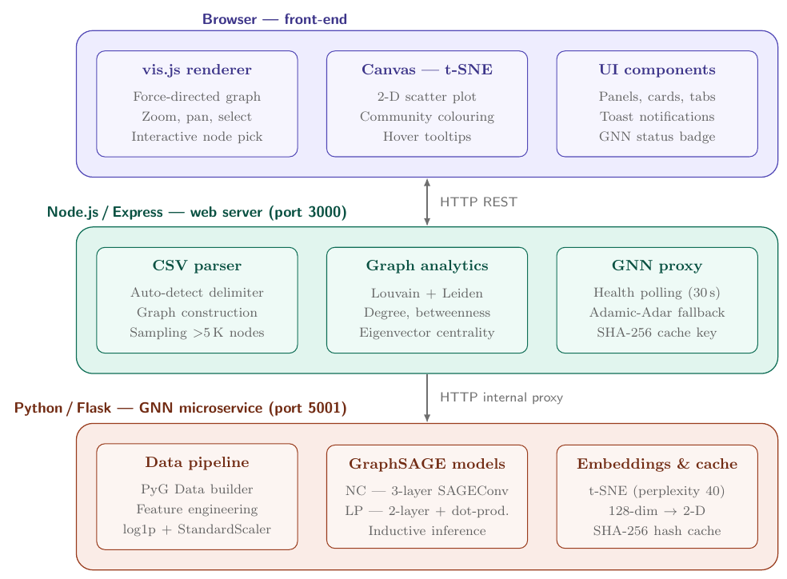
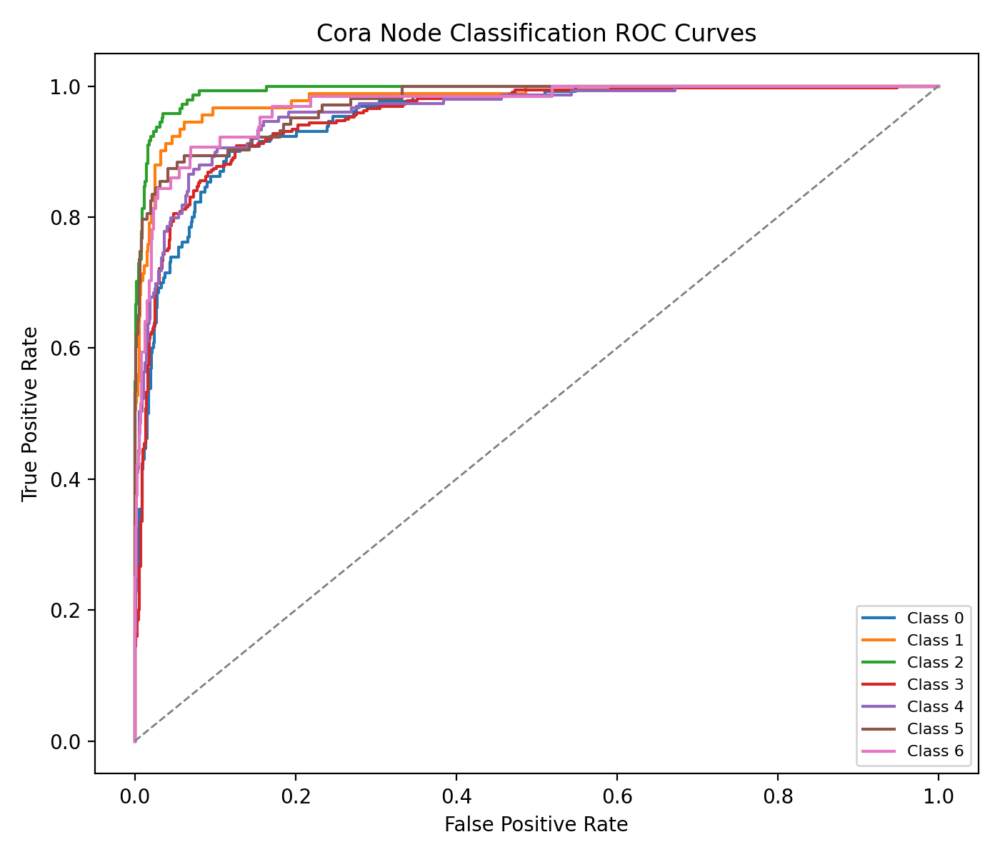

# Summary

Researchers increasingly work with relational data — citation networks, retweet graphs, protein
interaction maps, co-occurrence networks — that encode not just entities but the connections
between them. Understanding this kind of data usually requires two separate skill sets: network
science, to describe structure (who is central, which nodes cluster together), and machine
learning, to predict properties of that structure (which group will an unlabelled node join,
which link is likely to form next). `GraphML Studio` is an open-source, browser-based, no-code
platform that brings both of these capabilities into a single interactive interface. A user
uploads a CSV edge list and, without installing any software or writing any code, can visualise
the network, run community detection (Louvain and Leiden) and centrality analysis, and train
Graph Neural Network (GNN) models — specifically GraphSAGE [@hamilton2017inductive] — for node
classification and link prediction, including inference on nodes that did not exist when the
model was trained. The software is implemented as a two-tier system: a Node.js/Express service
handles graph construction and descriptive analytics, while a Python/Flask microservice, built on
PyTorch Geometric [@fey2019fast], handles all GNN training and inference. The two tiers
communicate over HTTP, and the descriptive-analytics tier continues to function with heuristic
fallbacks even if the learning tier is temporarily unavailable.

# Statement of need

Existing network-analysis tools force researchers to choose between accessibility and predictive
power. Desktop applications such as Gephi [@bastian2009gephi] and Cytoscape [@shannon2003cytoscape]
provide mature, well-regarded interfaces for visual and descriptive analysis — centrality,
community detection, layout — but offer no way to classify unlabelled nodes or predict missing
edges, and they require local installation and manual configuration. Graph database platforms
such as Neo4j [@neo4j2026] add some machine learning tooling but target enterprise deployments
and assume substantial programming and infrastructure experience. On the other end of the
spectrum, libraries such as PyTorch Geometric [@fey2019fast] give experienced practitioners full
control over GNN architectures, but using them requires writing and maintaining a Python codebase,
which excludes the large population of social scientists, digital humanities researchers,
epidemiologists, and other domain experts who work with network data but do not program.

This gap is a genuine barrier to research: a sociologist studying a retweet network, or an
epidemiologist studying a contact-tracing graph, may be able to articulate exactly what predictive
question they want answered — which unlabelled account belongs to which community, whether two
individuals are likely to interact — without having the tooling to answer it themselves.
`GraphML Studio` is designed to close this gap by putting an end-to-end pipeline, from raw CSV to
trained GNN to inductive inference on new nodes, behind a browser interface that requires no
installation and no code. It is aimed at researchers who need predictive network analysis as a
practical tool for their own domain work, rather than at machine learning practitioners who want
to design new GNN architectures.

# State of the field

To our knowledge, no existing tool combines browser-based access, interactive descriptive graph
analytics, and end-to-end GNN training and inference in a single no-code interface. Gephi
[@bastian2009gephi] and Cytoscape [@shannon2003cytoscape] remain the dominant descriptive tools
but are desktop-bound and non-predictive. Early browser-based visualisation platforms demonstrated that interactive graph rendering is feasible in modern JavaScript runtimes, but did not integrate learned models. `GraphML Studio` is positioned as a bridge between this descriptive tooling and the modelling capability of frameworks such as PyTorch Geometric [@fey2019fast], adopting established algorithms — Louvain [@blondel2008fast] and Leiden [@traag2019louvain] community detection, GraphSAGE [@hamilton2017inductive] for node classification and link prediction, and t-SNE [@vandermaaten2008visualizing] for embedding visualisation — rather than proposing new methods, and focusing its contribution on architecture, accessibility, and the engineering needed to make an inductive GNN pipeline usable without code.

# Software design and functionality

`GraphML Studio` uses a two-tier microservices architecture chosen specifically to isolate
descriptive analytics from deep learning, so that a failure or restart of the GNN service degrades
functionality gracefully rather than taking down the whole application.

**Analytics tier (Node.js/Express).** Parses uploaded CSV edge lists with automatic delimiter and
header detection, constructs the graph using the `graphology` library, runs Louvain and Leiden
community detection and centrality computation, samples graphs larger than 5,000 nodes for
interactive rendering, and proxies requests to the GNN tier. It polls the GNN service's health
endpoint every 30 seconds and falls back to Adamic–Adar heuristics and majority-vote classification
when that service is unreachable, so the descriptive-analytics workflow never depends on the
learning tier being available.

**Learning tier (Python/Flask).** Builds structural node features directly from the edge list
(degree, weighted degree, and edge-weight statistics), trains two GraphSAGE models — a 3-layer
network for node classification and a 2-layer encoder with a dot-product decoder for link
prediction — and runs t-SNE on the learned embeddings for visualisation. A key design feature is
*inductive inference*: because GraphSAGE learns an aggregation function rather than fixed
per-node embeddings, a user can submit a new node's connections to the existing graph and obtain a
classification without retraining, which matters for research settings where graphs grow or
change between analysis sessions. Trained model weights are cached to disk under a SHA-256 hash of
the canonicalised graph and hyperparameters, so identical re-uploads skip retraining entirely.

**Correctness and quality control.** Because JOSS review focuses on software correctness rather
than novel scientific findings, we validated the implementation — rather than benchmarked it as a
research contribution — against the standard Planetoid split of the Cora citation network
[@yang2016revisiting], a dataset with published reference results for both GraphSAGE tasks. Under
this protocol, the node classification model reached 76.7% accuracy (Macro-F1 0.759), and the link
prediction model reached an AUC-ROC of 0.783, both within the range reported in the original
GraphSAGE and SEAL literature [@hamilton2017inductive; @zhang2018link]. This is reported here only
as evidence that the training pipeline is implemented correctly, not as a research result in its
own right. The codebase additionally carries a suite of 60 automated tests (32 JavaScript with
Jest/Supertest, 28 Python with pytest/pytest-flask) covering CSV parsing edge cases, graph
construction, API contract behaviour, and an end-to-end training-and-inference check, all run
in-process without requiring a live server.

**Deployment.** The software is distributed as infrastructure-as-code (`render.yaml`) and is
currently hosted as two free-tier services on Render.com, chosen to keep the platform free to use;
any host that can run a Node.js and a Python/Flask service will work, and the repository includes
instructions for running both services locally, which is how we recommend reviewers and new users
first evaluate the software.

# Research impact statement

GraphML Studio has progressed from its original development as a Master's thesis project into a research tool for interactive network analysis and Graph Machine Learning. The software is currently being used as part of an ongoing research project involving multiple network representations derived from Twitter data, including tweet–tweet, user–tweet, and user–user networks. Within this workflow, GraphML Studio is used to compute baseline centrality measures and community-detection results across these graph representations, providing an interactive alternative to implementing these descriptive analyses separately in Python.

The underlying research project is ongoing, and its datasets, research questions, and empirical findings are therefore not publicly disclosed at this stage. The present use nevertheless provides evidence that GraphML Studio has been incorporated into an active research workflow rather than being developed solely as a demonstration application.

In addition to this ongoing research use, the Graph Neural Network functionality has been evaluated using the Cora citation-network benchmark. The implemented GraphSAGE workflow achieved 76.7% node-classification accuracy with a macro-F1 score of 0.759, while the link-prediction workflow achieved an AUC-ROC of 0.783. These experiments provide a publicly reproducible validation of the predictive-analysis components.

Together, the ongoing research use and publicly reproducible benchmark experiments demonstrate both practical research utility and verifiable software functionality. The software is intended to support researchers who require interactive network exploration and Graph Machine Learning workflows without implementing separate analysis pipelines for each task.

# AI usage disclosure

Generative AI tools were used during the development of this project as follows: *OpenAI Codex* were used for *writing some modules* in *JavaScript*. All AI-assisted output was
reviewed, tested, and edited by the authors, who made all architectural and design decisions
described in this paper.

# Acknowledgements

We thank the Vachani School of Advanced Computing at Ashoka University, and School of Engineering and Technology atPondicherry University, for supporting this work.

# References
